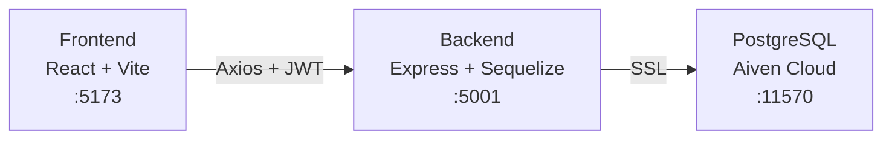

# Personal Expense Tracker — Project Review

## Overview

Full-stack expense tracker with **Node.js/Express** backend + **React/Vite** frontend, connected via CORS.

---

## UI Pages Review

### 1. Landing Page ✅


- **Fonts**: *Playfair Display* serif headings + *Outfit* body text
- **Background**: Sharp repeating finance icon pattern (wallets, charts, coins)
- **Navigation**: "Start Now" → Register, "Login" → Login, "Open App" → Login

---

### 2. Registration Page ✅


- Fields: Full Name, Email, Password, Confirm Password
- Glassmorphic card with backdrop blur
- Teal "Create Account" button — matches design system

---

### 3. Login Page ✅


- Fields: Email, Password
- Serif "Welcome Back" heading consistent with brand

---

### 4. Dashboard ✅

````carousel

<!-- slide -->

````

| Feature | Status |
|---------|--------|
| Stats Cards (Total, Entries, Average, Highest) | ✅ Working |
| Add/Edit Expense form | ✅ Working |
| Pie Chart (Top Distribution) | ✅ Working |
| Top 5 Expenses list | ✅ Working |
| Filters (Search, ₹ Amount Range, Sort) | ✅ Working |
| Expense Table with Edit/Delete | ✅ Working |
| Export CSV | ✅ Working |
| Delete All | ✅ Working |
| Logout | ✅ Working |

---

## End-to-End Flow


---

## Backend API Verification

| Endpoint | Method | Status |
|----------|--------|--------|
| `/api/health` | GET | ✅ `{"status":"OK"}` |
| `/api/auth/register` | POST | ✅ Returns JWT |
| `/api/auth/login` | POST | ✅ Returns JWT |
| `/api/auth/me` | GET | ✅ Returns user |
| `/api/categories` | CRUD | ✅ All operations |
| `/api/transactions` | CRUD | ✅ All operations |
| `/api/analytics/summary` | GET | ✅ Correct totals |

---

## Architecture



---

## Deployment Readiness

| Item | Status |
|------|--------|
| [vercel.json](file:///Users/lingampallysreearush/Desktop/tracker/frontend/vercel.json) SPA routing | ✅ Configured |
| [render.yaml](file:///Users/lingampallysreearush/Desktop/tracker/backend/render.yaml) backend | ✅ Configured |
| Environment variables | ✅ Documented |
| Production build | ✅ Zero errors |
| CORS for production | ✅ `CLIENT_URL` env var |
| SPA fallback routing | ✅ Fixed with `--single` |

---

## Tech Stack Summary

| Layer | Technology |
|-------|-----------|
| Frontend | React 19, Vite 8, Recharts, Axios |
| Backend | Node.js, Express, Sequelize, JWT |
| Database | PostgreSQL (Aiven Cloud) |
| Design | Outfit + Playfair Display fonts, CSS variables |
| Deploy | Vercel (frontend) + Render (backend) |
